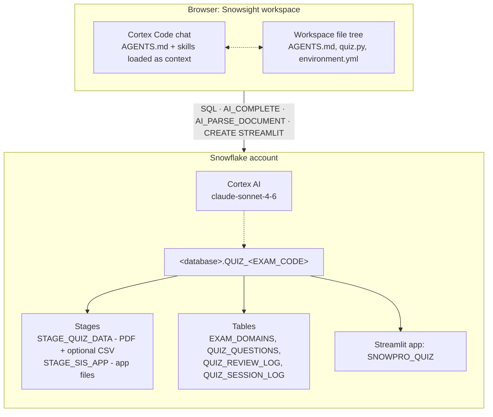
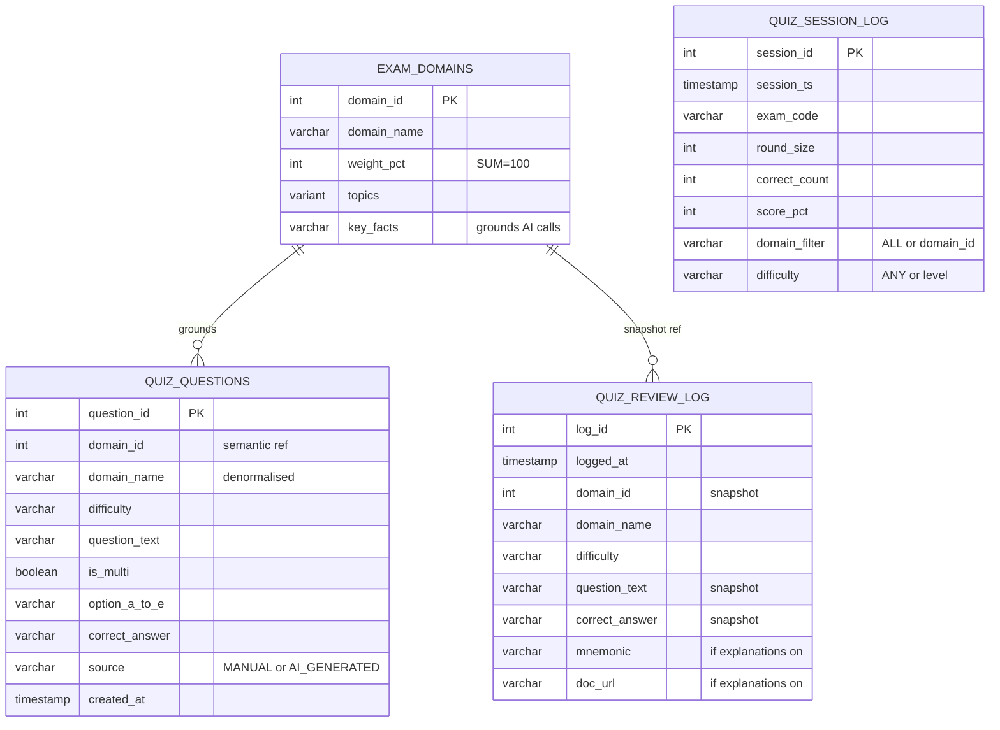

# Architecture

A tour of what runs where, how data flows from study guide PDF to quiz question to dashboard metric, and how the skills fit together. Read top-to-bottom the first time. Can later for the Mermaid diagrams and summary tables.

---

## high-level topology

Nothing runs locally. The PDF lives in a Snowflake stage. The Cortex Code lives in the Snowsight browser tab. The Streamlit app runs server-side in Snowflake. The workspace is the bridge - it holds `AGENTS.md` (project context), the skills (orchestration logic), and the generated `quiz.py` + `environment.yml` (app code). The agent never touches the user's local filesystem because there isn't one involved.

---

## setup data flow

The setup pipeline runs once per exam, orchestrated by `$setup-exam`. It has three hand-off points where the user acts: once to upload the study guide PDF (and optionally a CSV/JSON question bank) to a stage, once to approve the extracted domain list, and once to upload the generated Streamlit files to a second stage. Everything between those hand-offs is SQL the agent runs.

The pipeline starts after the user drops the PDF into `STAGE_QUIZ_DATA` via Snowsight's UI. The agent confirms the upload with `LIST @...`, then calls `AI_PARSE_DOCUMENT` in `LAYOUT` mode to convert the PDF into markdown. That markdown stays in the agent's working memory - it gets reused twice without a re-parse: first by `AI_COMPLETE` to extract domain names, weights (summing to 100), and topic taxonomies into `EXAM_DOMAINS`, then once per domain (in a second pass) to extract free-form `key_facts` that will later ground question generation and AI explanations.

At this point the user gets a checkpoint: approve the domain list, re-extract with a tweaked prompt, or abort. No write to `QUIZ_QUESTIONS` runs until approval.

The next branch depends on whether the user has a question bank. If yes, the agent runs `COPY INTO QUIZ_QUESTIONS FROM @stage/file.csv` with `source='MANUAL'`. If the CSV/JSON schema differs from the target table, `$adapt-questions` is invoked to map columns (Strategies A-E, one of which uses `AI_COMPLETE` to classify rows by domain). If there's no CSV/JSON, the agent generates questions directly via `AI_COMPLETE`, batched per domain - typically ~30 questions per domain in groups of 10, grounded on the `key_facts` extracted earlier. These questions are inserted into `QUIZ_QUESTIONS` so the user can use them later as `question bank` for the fast rounds.

Once `QUIZ_QUESTIONS` is populated, the agent updates two lines in `AGENTS.md` (schema name and exam code), then reads the `$quiz/*` skills and writes `quiz.py` + `environment.yml` as files in the workspace. Before those files are considered final, the agent runs `$sis/pre-deploy` - a 22-item scan that catches dollar-quoting bugs, `st.rerun()` count violations, missing `@st.cache_data` decorators, and other Streamlit-in-Snowflake pitfalls. The scan must fully pass.

The user then uploads both generated files to `STAGE_SIS_APP` via the Snowsight UI. The agent confirms the upload and runs `CREATE OR REPLACE STREAMLIT ... FROM @STAGE_SIS_APP`. The app is now live and shareable via its Snowsight URL.

### quick reference

| stage | input | output | mechanism |
|---|---|---|---|
| Parse PDF | PDF on `STAGE_QUIZ_DATA` | markdown (in-memory) | `AI_PARSE_DOCUMENT(mode=LAYOUT)` |
| Extract domains | markdown | `EXAM_DOMAINS` rows | `AI_COMPLETE` |
| Extract key facts | markdown + each domain | `EXAM_DOMAINS.key_facts` | `AI_COMPLETE` (per-domain) |
| User checkpoint | domain list | approval gate | `ask_user_question` |
| Load questions | CSV or key_facts | `QUIZ_QUESTIONS` rows | `COPY INTO` or `AI_COMPLETE` |
| Update context | `AGENTS.md` | schema + exam_code filled | file edit |
| Generate app | `$quiz/*` skills | `quiz.py` + `environment.yml` | file write in workspace |
| Scan | generated files | PASS gate | `$sis/pre-deploy` (22 items) |
| Deploy | files on `STAGE_SIS_APP` | live `SNOWPRO_QUIZ` | `CREATE STREAMLIT` |

---

## runtime data flow

Once the app is deployed, the agent is out of the loop. The user interacts with `quiz.py` running as Streamlit-in-Snowflake. The app talks directly to the four tables and (when needed) to `AI_COMPLETE`.

The user lands on the **Home** screen. Cached calls (`load_domains`, `load_session_stats`, `load_recent_sessions`, `load_domain_errors`) populate the sidebar with domain filters and recent progress. Caching matters here because Streamlit-in-Snowflake re-runs the entire render function tree on every widget interaction - without `@st.cache_data`, the Home screen would re-query four tables on every keystroke. TTLs are unbounded (cache per SiS session).

The user configures a round: size (5-50), domain filter (all or one), difficulty (any/easy/medium/hard), question source (`db` / `ai` / `mix`), and whether AI explanations should be generated on submit. Clicking **Start Round** initialises `round_history` in session state and calls `get_question()`, which decides where to fetch the next question based on `source`: from `QUIZ_QUESTIONS` (excluding already-shown texts via `_get_shown_texts()` on the round history), or via a live `AI_COMPLETE` grounded on `key_facts`, or a mix.

On the **Quiz** screen, the user selects options and submits. Each answer is recorded in `round_history` (with a snapshot of question text, chosen answer, correct answer, and domain). If the answer is wrong and explanations are enabled, a second `AI_COMPLETE` call generates `why_correct`, `why_wrong`, a mnemonic, and a documentation URL - rendered in an expander below the feedback. These are on-demand on purpose: explanations cost ~3 seconds of model latency each, so we generate them only for wrong answers and only once the user expands the disclosure.

When the round ends (last question submitted or user clicks **Finish**), the app transitions to the **Summary** screen and writes to two tables in a single batch: one `INSERT` into `QUIZ_SESSION_LOG` with the round aggregate (score_pct, correct_count, filters used), and one `INSERT` per wrong answer into `QUIZ_REVIEW_LOG`. The write happens once, atomically at round end - not per-question. This keeps the session log tidy and avoids a partial-round artefact if the user bails mid-round (intentionally - bailing is "discard this round").

The **Review** page (separate sidebar pill) has two tabs: **Wrong Answers** shows filtered `QUIZ_REVIEW_LOG` history with domain and date filters, and **Learning Dashboard** shows session trends (score-per-session line chart from `QUIZ_SESSION_LOG`, error distribution from `QUIZ_REVIEW_LOG` grouped by domain, readiness score against the 75% threshold). Optional features like flashcards, exam simulation, or achievement badges live as additional tabs or sidebar widgets - they read the same four tables, they don't add new ones.

### invariants (things that must stay true)

- **Every `AI_COMPLETE` call** goes through `call_cortex()` (dollar-quoting + `$$` sanitization) and `parse_cortex_json()` (strips markdown fences, handles double-encoding). Never raw `json.loads()`.
- **Deduplication within a round** uses `_get_shown_texts()` reading `round_history`, not session state keys and not the DB. Deduplication across rounds is an intentional non-goal - the same question can reappear in a later round.
- **Write-back happens once**, at round end on "Finish". Not incrementally per question. This keeps `QUIZ_SESSION_LOG` atomic - one row per round, no partials.
- **Exactly six `st.rerun()` calls** in `quiz.py`: Start Round, lazy-load at top of `render_quiz`, Retry, Submit Answer, Finish, Next. Streamlit-in-Snowflake v1.52 has known-buggy behaviour outside these six call sites. The pre-deploy scan enforces the count as a regression guard.

---

## table relationships

**Why four tables, not three.** `QUIZ_REVIEW_LOG` stores per-wrong-question data for the Review tab and per-domain error analysis. `QUIZ_SESSION_LOG` stores per-round aggregates needed for progress metrics. The tables must be separate because a round with zero wrong answers produces zero review rows but still needs a session row - merging the two would lose session data for perfect rounds, which is exactly the signal "am I ready for the exam?" depends on.

**Why `QUIZ_REVIEW_LOG` is not FK-linked to `QUIZ_QUESTIONS`.** Review rows are historical snapshots. They copy `question_text`, `correct_answer`, `domain_name` at the moment the answer was logged, so deleting or regenerating a question later doesn't orphan the history. The `domain_id` in `QUIZ_REVIEW_LOG` is a semantic reference to `EXAM_DOMAINS` (for grouping and dashboards), not an enforced FK.

**Why `domain_name` is denormalised.** Every screen filters or groups by domain. Storing the name alongside the id saves a join on every query. Domain names are immutable per schema (set once in `$setup-exam` Step 5 and backfilled everywhere), so drift isn't a concern.

---

## skill dependency

Skills are intentionally small and single-purpose. The 22-item pre-deploy scan is its own skill. The 8-item prompt audit is another. The 5-step Cortex diagnostic is a third. Each has one job, loaded only when the intent matches. This keeps context usage low - Cortex Code doesn't pull in question-generation guidance when the user is debugging a stage permission error.

**At setup time** (driven by `$setup-exam`), Steps 1-4 are plain SQL (`CREATE SCHEMA`, `CREATE STAGE`, `CREATE TABLE`, `LIST`) with no skills involved. Step 5 (domain extraction) pulls in `$cortex/patterns` for the `AI_PARSE_DOCUMENT` + `AI_COMPLETE` call patterns. Step 6 (question loading) branches: the CSV path optionally pulls `$adapt-questions` (which itself pulls `$cortex/patterns` if the column-mapping strategy uses AI); the AI-generation path pulls `$cortex/patterns` + `$cortex/prompt-audit` (to catch bad prompts before they generate thousands of bad rows). Step 7 is a plain `AGENTS.md` edit. Step 8 (app generation) is the heaviest: `$quiz/screens` + `$quiz/questions` + `$quiz/style`, optionally `$quiz/features` if the user asked for optional features, and mandatorily `$sis/pre-deploy` for the 22-item scan. Steps 9-10 are plain SQL again.

**At runtime** the agent is not involved at all. `quiz.py` contains baked-in versions of the patterns from `$cortex/patterns` (`call_cortex`, `parse_cortex_json`, dollar-quoting) and from `$quiz/questions` (`DIFFICULTY_GUIDE` constant, topic schedule algorithm) - not loaded dynamically but copied in during Step 8.

**Troubleshooting** is reactive and on-demand. If the user reports "AI returns weird JSON", the agent loads `$cortex/patterns` (5-step diagnostic). If the user reports "questions are low quality", the agent loads `$cortex/prompt-audit` (8-item scan). If the app crashes, the agent re-runs `$sis/pre-deploy` on the current `quiz.py`. If screens glitch, the agent re-reads `$quiz/screens`. One skill per failure class.

### quick reference

| caller | uses | purpose |
|---|---|---|
| `$setup-exam` Step 5 | `$cortex/patterns` | `AI_PARSE_DOCUMENT` + `AI_COMPLETE` patterns |
| `$setup-exam` Step 6 (CSV) | `$adapt-questions` (optional) | column mapping strategies |
| `$adapt-questions` Strategy D | `$cortex/patterns` | AI classification of CSV/JSON rows |
| `$setup-exam` Step 6 (AI) | `$cortex/patterns` + `$cortex/prompt-audit` | generation + prompt QA |
| `$setup-exam` Step 8 | `$quiz/{screens,questions,style}` + `$sis/pre-deploy` | app generation + scan |
| `$setup-exam` Step 8 (optional) | `$quiz/features` | optional app features |
| troubleshooting: AI error | `$cortex/patterns` | 5-step diagnostic |
| troubleshooting: bad output | `$cortex/prompt-audit` | 8-item prompt scan |
| troubleshooting: app crash | `$sis/pre-deploy` | 22-item Streamlit scan |

---

## why this shape

A few architectural decisions worth knowing:

- **Schema-per-exam** is the mandatory isolation boundary, because Snowsight has no `git` the agent can run to isolate code per exam. A schema is the cleanest isolation Snowflake offers natively. (If the workspace is Git-backed the user can optionally create a branch per exam on top - same category as uploading files manually.)
- **`AI_PARSE_DOCUMENT` + `AI_COMPLETE`** instead of `AI_EXTRACT` because we need both structured extraction (domains, weights, topic taxonomies) and free-form extraction (key_facts) from the same PDF. Re-parsing per pass would be wasteful; parse once, reuse the markdown for both extractions.
- **Cached `load_*` functions** in `quiz.py` because Streamlit-in-Snowflake re-renders the whole function tree on every widget interaction. Without `@st.cache_data`, every Next/Submit would re-query four tables. TTL is unbounded (cache per SiS session).
- **Exactly six `st.rerun()` calls** because SiS v1.52 has known-buggy behaviour outside the six accepted call sites. The pre-deploy scan enforces the count as a regression guard.
- **Explanations on-demand, not eager**: each explanation is ~1-3 seconds of `AI_COMPLETE`. Generating for every answer would make the app feel broken. Generating on expand-disclosure hides the latency behind the click.