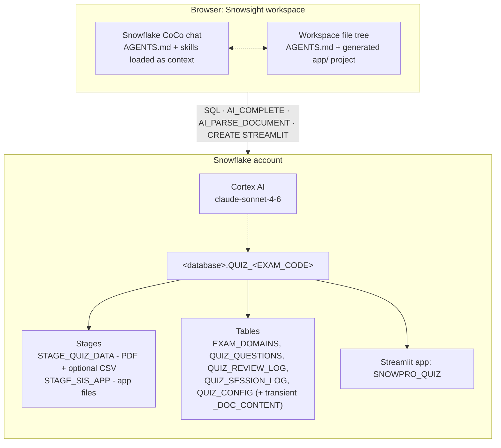
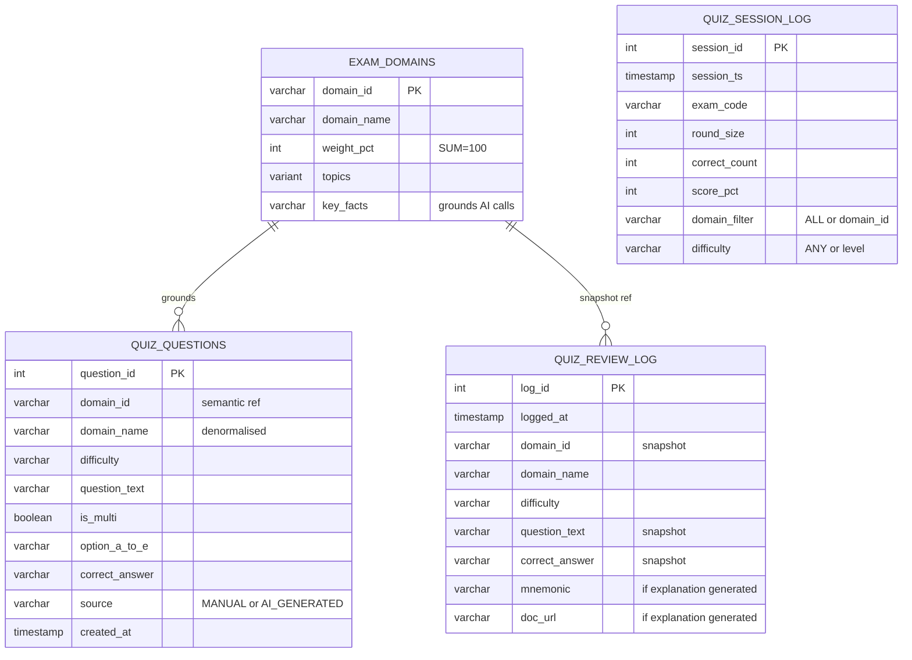

# Architecture

A tour of what runs where, how data flows from study guide PDF to quiz question to dashboard metric, and how the skills fit together. Read top-to-bottom the first time. Can later for the Mermaid diagrams and summary tables.

---

## High-level topology

```mermaid
flowchart TB
    subgraph Browser["Browser: Snowsight workspace"]
        CC["Snowflake CoCo chat<br/>AGENTS.md + skills loaded as context"]
        WS["Workspace file tree<br/>AGENTS.md + generated app/ project"]
        CC <-.-> WS
    end

    subgraph Snowflake["Snowflake account"]
        direction TB
        SCHEMA["&lt;database&gt;.QUIZ_&lt;EXAM_CODE&gt;"]
        STAGES["Stages<br/>STAGE_QUIZ_DATA - PDF + optional CSV<br/>STAGE_SIS_APP - app files"]
        TABLES["Tables<br/>EXAM_DOMAINS, QUIZ_QUESTIONS, QUIZ_REVIEW_LOG,<br/>QUIZ_SESSION_LOG, QUIZ_CONFIG (+ transient _DOC_CONTENT)"]
        APP["Streamlit app: SNOWPRO_QUIZ"]
        AI["Cortex AI<br/>claude-sonnet-4-6"]
        SCHEMA --> STAGES
        SCHEMA --> TABLES
        SCHEMA --> APP
        AI -.-> SCHEMA
    end

    Browser -->|"SQL · AI_COMPLETE · AI_PARSE_DOCUMENT · CREATE STREAMLIT"| Snowflake
```

Nothing runs locally. The PDF lives in a Snowflake stage. CoCo lives in the Snowsight browser tab. The Streamlit app runs server-side in Snowflake (`environment.yml`, Snowflake Anaconda channel). The workspace is the bridge - it holds `AGENTS.md` (project context), the skills (orchestration logic), and the generated `app/` project (app code). The agent never touches the user's local filesystem because there isn't one involved.

---

## Setup data flow

The setup pipeline runs once per exam, orchestrated by `$setup-exam`. It has **one** data hand-off where the user acts — dropping the study-guide PDF (and optionally a CSV/JSON question bank) into the workspace file tree — plus the domain-approval checkpoint. The agent stages and deploys everything else via `COPY FILES`; there is no manual stage upload.

The pipeline starts after the user drops the PDF into the workspace. The agent copies it onto `STAGE_QUIZ_DATA` with `COPY FILES`, confirms with `LIST @...`, then calls `AI_PARSE_DOCUMENT` in `LAYOUT` mode to convert the PDF into Markdown. That Markdown stays in the agent's working memory - it gets reused twice without a re-parse: first by `AI_COMPLETE` to extract domain names, weights (summing to 100), and topic taxonomies into `EXAM_DOMAINS`, then once per domain (in a second pass) to extract free-form `key_facts` that will later ground question generation and AI explanations.

At this point the user gets a checkpoint: approve the domain list, re-extract with a tweaked prompt, or abort. No write to `QUIZ_QUESTIONS` runs until approval.

The next branch depends on whether the user has a question bank. If yes, the agent runs `COPY INTO QUIZ_QUESTIONS FROM @stage/file.csv` with `source='MANUAL'`. If the CSV/JSON schema differs from the target table, `$adapt-questions` is invoked to map columns (Strategies A-E, one of which uses `AI_COMPLETE` to classify rows by domain). If there's no CSV/JSON, the bank deliberately stays **empty** — no build-time generation (slow, burns the user's token budget); the app runs on runtime AI questions, and the agent hands the user the seeding options instead (Admin "Generate batch", the worksheet recipe in customization.md section 6, a scheduled task/Automation).

Once `QUIZ_QUESTIONS` is populated, the agent updates two lines in `AGENTS.md` (schema name and exam code), then reads the `$quiz/*` **and `$sis` skills** and writes the decomposed `app/` project — `snowflake.yml` + `.streamlit/config.toml` first (project identity + Workspace recognition), then the entry point, `_*.py` modules, and `pages/`. Generating `snowflake.yml` at the project root is what makes the Workspace treat the folder as a Streamlit app (no "Convert to Streamlit app" needed). Before those files are final, the agent runs `$sis` - a scan across all app files that catches SQL-injection risks, `ttl`-on-cache, `unsafe_allow_html`, and other pitfalls. Because the generation rules come from the same skills, the scan is a final confirmation, not a cleanup pass.

The agent deploys without any manual upload: it copies `app/` from the workspace's internal stage onto `STAGE_SIS_APP` with `COPY FILES`, then runs `CREATE OR REPLACE STREAMLIT … QUERY_WAREHOUSE = …` (`pandas`/`altair` come from the Snowflake Anaconda channel). The app is then live and shareable via its Snowsight URL.

### Quick reference

| Stage | Input | Output | Mechanism |
|---|---|---|---|
| Parse PDF | PDF on `STAGE_QUIZ_DATA` | Markdown (in-memory) | `AI_PARSE_DOCUMENT(mode=LAYOUT)` |
| Extract domains | Markdown | `EXAM_DOMAINS` rows | `AI_COMPLETE` |
| Extract key facts | Markdown + each domain | `EXAM_DOMAINS.key_facts` | `AI_COMPLETE` (per-domain) |
| User checkpoint | domain list | approval gate | `ask_user_question` |
| Load questions (optional) | CSV, if provided | `QUIZ_QUESTIONS` rows (else empty) | `COPY INTO` (no build-time generation) |
| Update context | `AGENTS.md` | schema + exam_code filled | file edit |
| Generate app | `$quiz/*` skills | `app/` project | file write in workspace |
| Scan | generated files | PASS gate | `$sis` (all items) |
| Deploy | `app/` in workspace | live `SNOWPRO_QUIZ` | agent `COPY FILES` → `STAGE_SIS_APP` + `CREATE STREAMLIT` |

---

## Runtime data flow

Once the app is deployed, the agent is out of the loop. The user interacts with the deployed app running as Streamlit-in-Snowflake. The app talks directly to the five tables and (when needed) to `AI_COMPLETE` — every runtime generation grounded on the docs CKE.

The user lands on the **Home** screen. Cached calls (`load_domains`, `load_session_stats`, `load_recent_sessions`, `load_domain_errors`) populate the sidebar with domain filters and recent progress. Caching matters here because Streamlit-in-Snowflake re-runs the entire render function tree on every widget interaction - without `@st.cache_data`, the Home screen would re-query several tables on every keystroke. TTLs are unbounded (cache per SiS session).

The user configures a round: size (5-50), domain filter (all or one), difficulty (any/easy/medium/hard), and question source (`db` / `ai` / `mix`). (There is no explanations toggle — the AI explanation is on-demand per question.) Clicking **Start Round** initialises `round_history` in session state and calls `get_question()`, which decides where to fetch the next question based on `source`: from `QUIZ_QUESTIONS` (excluding already-shown texts via `_get_shown_texts()` on the round history, selected with `ORDER BY RANDOM()`), or via a live `AI_COMPLETE` grounded on the docs CKE, or a mix. Every runtime-generated AI question is also persisted back to `QUIZ_QUESTIONS` (`source='AI_GENERATED'`), so the bank fills as the user practices.

On the **Quiz** screen, the user selects options and submits. Each answer is recorded in `round_history` (with a snapshot of question text, chosen answer, correct answer, and domain). After submitting — for correct answers too — the user can click **💡 AI explanation** to generate `why_correct`, `why_wrong`, a mnemonic, and a documentation link on demand, rendered in an expander; the same expander offers a 🔬 Deep dive on one option (and a ⚖️ Compare-two control when the Comparison feature is enabled). In `cke`/`custom` mode the explanation first retrieves real doc chunks via `_search.py`, grounds the reasoning on them, and cites the chunk's exact `SOURCE_URL` (plus a short excerpt), never built-in knowledge; the generic `doc_search` search-link heuristic applies only in the ungrounded `none` mode. Explanations are on-demand on purpose: each costs ~1-3 seconds of model latency, so they generate only when the user asks.

When the round ends (last question submitted or user clicks **Finish**), the app transitions to the **Summary** screen and writes to two tables in a single batch: one `INSERT` into `QUIZ_SESSION_LOG` with the round aggregate (score_pct, correct_count, filters used), and one `INSERT` per wrong answer into `QUIZ_REVIEW_LOG`. The write happens once, atomically at round end - not per-question. This keeps the session log tidy and avoids a partial-round artefact if the user bails mid-round (intentionally - bailing is "discard this round").

The **Review** page (separate sidebar pill) has tabs: **Wrong Answers** (filtered `QUIZ_REVIEW_LOG` history with domain and date-range filters), **Learning Dashboard** (session trends — score-per-session line chart from `QUIZ_SESSION_LOG`, error distribution from `QUIZ_REVIEW_LOG` grouped by domain, readiness score against the 75% threshold), and **Flashcards** when that feature is enabled. The five optional features are Exam Simulation, Flashcards, AI Study Recommendation, Comparison, and Remedial Round; most read the existing tables, though Flashcards adds `FLASHCARD_PROGRESS` and Exam Simulation adds a `session_type` column to `QUIZ_SESSION_LOG`.

### Invariants (things that must stay true)

- **Every `AI_COMPLETE` call** goes through `_cortex.py`: `call_cortex()` for free text, `call_cortex_json()` with a `RESPONSE_FORMATS` schema for JSON (dollar-quoting + `$$` sanitization in both). Structured outputs guarantee schema-conformant JSON — there is no fence-stripping parser.
- **Deduplication within a round** uses `_get_shown_texts()` reading `round_history`, not session state keys and not the DB. Deduplication across rounds is an intentional non-goal - the same question can reappear in a later round.
- **Write-back happens once**, at round end on "Finish". Not incrementally per question. This keeps `QUIZ_SESSION_LOG` atomic - one row per round, no partials.
- **`st.rerun()` discipline** - every slow button handler wraps its work in `st.spinner()` and ends with a single `st.rerun()` after setting state (see `$sis`).

---

## Table relationships

```mermaid
erDiagram
    EXAM_DOMAINS {
        varchar domain_id PK
        varchar domain_name
        int weight_pct "SUM=100"
        variant topics
        varchar key_facts "grounds AI calls"
    }
    QUIZ_QUESTIONS {
        int question_id PK
        varchar domain_id "semantic ref"
        varchar domain_name "denormalised"
        varchar difficulty
        varchar question_text
        boolean is_multi
        varchar option_a_to_e
        varchar correct_answer
        varchar source "MANUAL or AI_GENERATED"
        timestamp created_at
    }
    QUIZ_REVIEW_LOG {
        int log_id PK
        timestamp logged_at
        varchar domain_id "snapshot"
        varchar domain_name
        varchar difficulty
        varchar question_text "snapshot"
        varchar correct_answer "snapshot"
        varchar mnemonic "if explanation generated"
        varchar doc_url "if explanation generated"
    }
    QUIZ_SESSION_LOG {
        int session_id PK
        timestamp session_ts
        varchar exam_code
        int round_size
        int correct_count
        int score_pct
        varchar domain_filter "ALL or domain_id"
        varchar difficulty "ANY or level"
    }

    EXAM_DOMAINS ||--o{ QUIZ_QUESTIONS : "grounds"
    EXAM_DOMAINS ||--o{ QUIZ_REVIEW_LOG : "snapshot ref"
```

(A fifth table, `QUIZ_CONFIG`, holds runtime app configuration for the Admin page — key-value, outside the ER above; it also stores `grounding_mode`, fixed at setup. A transient `_DOC_CONTENT` holds the parsed PDF during setup and is dropped afterward. Enabled optional features add their own schema: Flashcards → `FLASHCARD_PROGRESS`; Exam Simulation → a `session_type` column on `QUIZ_SESSION_LOG`.)

**Why `QUIZ_REVIEW_LOG` and `QUIZ_SESSION_LOG` are separate tables.** `QUIZ_REVIEW_LOG` stores per-wrong-question data for the Review tab and per-domain error analysis. `QUIZ_SESSION_LOG` stores per-round aggregates needed for progress metrics. The tables must be separate because a round with zero wrong answers produces zero review rows but still needs a session row - merging the two would lose session data for perfect rounds, which is exactly the signal "am I ready for the exam?" depends on.

**Why `QUIZ_REVIEW_LOG` is not FK-linked to `QUIZ_QUESTIONS`.** Review rows are historical snapshots. They copy `question_text`, `correct_answer`, `domain_name` at the moment the answer was logged, so deleting or regenerating a question later doesn't orphan the history. The `domain_id` in `QUIZ_REVIEW_LOG` is a semantic reference to `EXAM_DOMAINS` (for grouping and dashboards), not an enforced FK.

**Why `domain_name` is denormalised.** Every screen filters or groups by domain. Storing the name alongside the id saves a join on every query. Domain names are immutable per schema (set once in `$setup-exam` Step 5 and backfilled everywhere), so drift isn't a concern.

---

## Skill dependency

Skills are intentionally small and single-purpose: `$cortex` holds the AI deltas (structured outputs, the prompt-audit checklist, the diagnostics runbook), `$sis` the SiS gotchas + the pre-deploy scan, `$quiz/*` the app contracts. Each loads only when the intent matches. This keeps context usage low - CoCo doesn't pull in question-generation guidance when the user is debugging a stage permission error.

**At setup time** (driven by `$setup-exam`), Steps 1-4 are plain SQL (`CREATE SCHEMA`, `CREATE STAGE`, `CREATE TABLE`, `LIST`) with no skills involved. Step 5 (domain extraction) pulls in `$cortex` for the `AI_PARSE_DOCUMENT` + `AI_COMPLETE` call patterns. Step 6 (question loading) branches: the CSV path optionally pulls `$adapt-questions` (which itself pulls `$cortex` if the column-mapping strategy uses AI); the AI-generation path pulls `$cortex` (generation + a prompt-audit pass to catch bad prompts before they generate thousands of bad rows). Step 7 is a plain `AGENTS.md` edit. Step 8 (app generation) is the heaviest: `$quiz/screens` + `$quiz/questions` + `$quiz/design`, optionally `$quiz/features` if the user asked for optional features, and mandatorily `$sis` for the scan. Steps 9-10 are plain SQL again.

**At runtime** the agent is not involved at all. The app modules contain baked-in versions of the patterns from `$cortex` (`call_cortex`, dollar-quoting — in `_cortex.py`) and from `$quiz/questions` (`DIFFICULTY_GUIDE` constant, topic schedule algorithm — in `_config.py` / `_questions.py`) - not loaded dynamically but copied in during Step 8.

**Troubleshooting** is reactive and on-demand. If the user reports "AI returns weird JSON", the agent loads `$cortex` (diagnostics runbook). If the user reports "questions are low quality", the agent loads `$cortex` (prompt-audit checklist). If the app crashes, the agent re-runs `$sis` on the current app files. If screens glitch, the agent re-reads `$quiz/screens`. One skill per failure class.

### Quick reference

| Caller | Uses | Purpose |
|---|---|---|
| `$setup-exam` Step 5 | `$cortex` | `AI_PARSE_DOCUMENT` + `AI_COMPLETE` patterns |
| `$setup-exam` Step 6 (CSV) | `$adapt-questions` (optional) | column mapping strategies |
| `$adapt-questions` Strategy D | `$cortex` | AI classification of CSV/JSON rows |
| `$setup-exam` Step 6 (AI) | `$cortex` | generation + prompt QA |
| `$setup-exam` Step 8 | `$quiz/{screens,questions,design}` + `$sis` | app generation + scan |
| `$setup-exam` Step 8 (optional) | `$quiz/features` | optional app features |
| troubleshooting: AI error | `$cortex` | diagnostics runbook |
| troubleshooting: bad output | `$cortex` | prompt-audit checklist |
| troubleshooting: app crash | `$sis` | Streamlit pre-deploy scan |

---

## Why this shape

A few architectural decisions worth knowing:

- **Schema-per-exam** is the mandatory isolation boundary, because Snowsight has no `git` the agent can run to isolate code per exam. A schema is the cleanest isolation Snowflake offers natively. (If the workspace is Git-backed the user can optionally create a branch per exam on top.)
- **`AI_PARSE_DOCUMENT` + `AI_COMPLETE`** instead of `AI_EXTRACT` because we need both structured extraction (domains, weights, topic taxonomies) and free-form extraction (key_facts) from the same PDF. Re-parsing per pass would be wasteful; parse once, reuse the Markdown for both extractions.
- **Cached `load_*` functions** in `_data.py` because Streamlit-in-Snowflake re-renders the whole function tree on every widget interaction. Without `@st.cache_data`, every Next/Submit would re-query several tables. TTL is unbounded (cache per SiS session).
- **`st.rerun()` discipline, not a fixed count** - handlers pair `st.spinner()` with a single final `st.rerun()` (see `$sis`).
- **Explanations on-demand, not eager**: each explanation is ~1-3 seconds of `AI_COMPLETE`. Generating for every answer would make the app feel broken. Generating on expand-disclosure hides the latency behind the click.